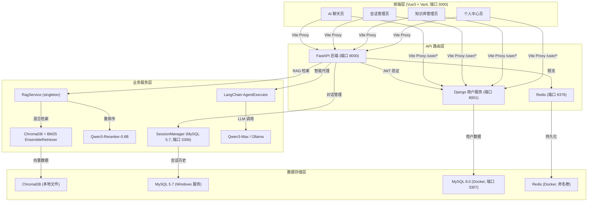

# 🚀 RAG对话系统

<div align="center">
<a href="https://github.com/RMA-MUN/LangChain-RAG-FastAPI-Service/stargazers">
  
</a>
<a href="https://github.com/RMA-MUN/LangChain-RAG-FastAPI-Service/network/members">
  
</a>
  
</div>

## 📋 目录

- [项目简介](#项目简介)
- [核心特性](#核心特性)
- [项目架构](#项目架构)
- [项目演示](#项目演示)
- [快速开始](#快速开始)
- [技术栈](#技术栈)
- [项目结构](#项目结构)
- [API 文档](#api文档)
- [配置说明](#配置说明)
- [部署指南](#部署指南)
- [开发指南](#开发指南)
- [故障排除](#故障排除)
- [文档](#文档)
- [联系方式](#联系方式)

## 项目简介

基于 **FastAPI + LangChain** 构建的企业级智能对话系统，集成先进的 **RAG（检索增强生成）** 技术，能够基于文档内容提供高精度的智能问答服务。系统采用微服务架构，具备会话持久化、知识库管理、多语言支持和模块化设计等特性。

## 核心特性

- **智能问答** 💬：基于 RAG 技术，结合文档检索和大语言模型，提供精准的问答体验
- **会话持久化** 💾：使用 MySQL 存储会话历史，支持长期保存和回溯
- **知识库管理** 📄：支持 PDF、TXT、MD、DOCX、PPTX 文档上传、处理和智能检索，提供独立的知识库管理页面
- **混合检索** 🔍：向量检索（ChromaDB）+ 关键词检索（BM25）融合，BM25 索引仅在文档变更时重建，高效复用
- **文档重排序** ⚖️：集成 Qwen3-Reranker-0.6B 对召回结果精排，提升答案准确性
- **双平台 LLM** 🤖：支持阿里云百炼（Qwen3-Max）和本地 Ollama 模型，灵活切换
- **多语言支持** 🌐：前端集成 i18n，支持中英文界面切换
- **微服务架构** 🏗️：分离的用户服务（Django）和对话服务（FastAPI），易于扩展和维护
- **速率限制** ⚡：Redis 驱动的接口限流，防止滥用

## 项目架构



## 项目演示

### AI 聊天界面


### 聊天管理界面


### 知识库管理界面
上传 PDF/TXT/MD/DOCX/PPTX 文件，文档自动向量化存入知识库，支持一键清空。

### 用户服务界面


## 快速开始

### 环境要求

| 环境 | 版本要求 | 说明 |
|------|----------|------|
| Python | 3.12+ | 后端及用户服务运行时 |
| uv | 0.11.9+ | Python 包管理器 |
| Node.js | 16+ | 前端构建工具 |
| Docker Desktop | 最新版 | 运行 MySQL 8 和 Redis |
| MySQL 5.7 | Windows 服务 | FastAPI 会话历史数据库（端口 3306）|
| Ollama | 最新版 | 本地嵌入模型（可选，推荐） |

> **注意**：Django 用户服务要求 MySQL 8.0.11+，通过 Docker 提供，端口 3307。FastAPI 对话服务使用 Windows 本地 MySQL 5.7，端口 3306。

### 克隆项目

```bash
git clone https://github.com/RMA-MUN/LangChain-RAG-FastAPI-Service.git
cd LangChain-RAG-FastAPI-Service
```

### 安装依赖

#### 后端依赖
```bash
cd backend
uv sync
```

#### 用户服务依赖
```bash
cd DjangoUserService
uv sync
```

#### 前端依赖
```bash
cd front
npm install
```

### 环境配置

#### 1. 后端环境变量（`backend/.env`）

复制 `backend/.env.example` 并按实际情况填写：

```env
# ==================== LLM 大模型配置 ====================
# LLM类型：ALIYUN | OLLAMA
LLM_TYPE=ALIYUN

# ==================== Ollama 配置 (LLM_TYPE=OLLAMA) ====================
OLLAMA_BASE_URL=http://localhost:11434
OLLAMA_MODEL_NAME=qwen3:0.6b

# ==================== 阿里云百炼配置 (LLM_TYPE=ALIYUN) ====================
ALIYUN_ACCESS_KEY_SECRET=your_api_key
ALIYUN_BASE_URL=https://dashscope.aliyuncs.com/compatible-mode/v1
ALIYUN_MODEL_NAME=qwen3-max

# ==================== 向量嵌入模型配置 ====================
# EMBED_MODEL_TYPE: OLLAMA | ALIYUN
EMBED_MODEL_TYPE=OLLAMA
TEXT_EMBEDDING_MODEL_NAME=qwen3-embedding:0.6b
ALIYUN_EMBED_MODEL_NAME=qwen3-embedding

# ==================== 数据库配置 ====================
# FastAPI 使用本地 MySQL 5.7（端口 3306）
MYSQL_USER=root
MYSQL_PASSWORD=your_mysql_password
MYSQL_HOST=localhost
MYSQL_PORT=3306
MYSQL_DATABASE=chat_history

REDIS_HOST=localhost
REDIS_PORT=6379
REDIS_DB=0

# ==================== 服务配置 ====================
DJANGO_API_URL=http://127.0.0.1:8001

# ==================== LangSmith 调试追踪（可选）====================
LANGCHAIN_TRACING_V2=false
LANGCHAIN_API_KEY=your_langsmith_api_key
LANGCHAIN_PROJECT=my-fastapi-langchain-project

# ==================== 重排序模型配置 ====================
# 首次启动时自动从 ModelScope 下载（约 1.1GB）
RERANKER_MODEL_PATH=D:\Hugging_Face\models\Qwen3-Reranker-0.6B

# ==================== JWT 身份验证配置 ====================
# 必须与用户服务的 JWT_SECRET_KEY 保持一致
SECRET_KEY=MY_JWT_SECRET_KEY
ALGORITHM=HS256
```

#### 2. 用户服务环境变量（`DjangoUserService/.env`）

```env
# JWT 配置（必须与 backend/.env 的 SECRET_KEY 一致）
JWT_SECRET_KEY=MY_JWT_SECRET_KEY

# 数据库配置（Django 使用 Docker 内的 MySQL 8，端口 3307）
DB_PORT=3307
DB_NAME=user_service
DB_USER=root
DB_PASSWORD=your_mysql_password
DB_HOST=localhost

# Redis 配置
CELERY_BROKER_URL=redis://localhost:6379/0
CELERY_RESULT_BACKEND=redis://localhost:6379/0
REDIS_CACHE_URL=redis://localhost:6379/1
```

### 启动基础服务（Docker）

#### 启动 MySQL 8（Django 用户服务专用，端口 3307）

```bash
# 首次创建（含命名卷持久化）
docker run -d \
  --name mysql8 \
  -e MYSQL_ROOT_PASSWORD=your_mysql_password \
  -e MYSQL_DATABASE=user_service \
  -p 3307:3306 \
  --default-authentication-plugin=mysql_native_password \
  -v mysql8_data:/var/lib/mysql \
  mysql:8.0

# 后续直接启动已有容器
docker start mysql8
```

#### 启动 Redis（端口 6379）

```bash
# 首次创建（含命名卷持久化）
docker run -d \
  --name redis \
  -p 6379:6379 \
  -v redis_data:/data \
  redis:latest redis-server --appendonly yes

# 后续直接启动已有容器
docker start redis
```

#### 启动 MySQL 5.7（FastAPI 会话数据库，Windows 服务）

```powershell
net start mysql
```

> 首次使用需手动创建 `chat_history` 数据库：
> ```sql
> CREATE DATABASE chat_history CHARACTER SET utf8mb4 COLLATE utf8mb4_unicode_ci;
> ```

#### 启动 Ollama（本地嵌入模型，如使用 OLLAMA 嵌入）

```bash
ollama serve
ollama pull qwen3-embedding:0.6b
```

### 初始化用户服务数据库

```bash
cd DjangoUserService
uv run python manage.py migrate
```

### 启动应用服务

| 服务 | 命令 | 端口 |
|------|------|------|
| FastAPI 后端 | `cd backend && uv run uvicorn main:app --host 0.0.0.0 --port 8000` | 8000 |
| Django 用户服务 | `cd DjangoUserService && uv run python manage.py runserver 0.0.0.0:8001` | 8001 |
| Vue 前端 | `cd front && npm run dev` | 3000 |

> **局域网访问**：前端和后端均绑定 `0.0.0.0`，同一局域网内的设备可通过 `http://<本机IP>:3000` 访问。

### 访问地址

| 入口 | 地址 |
|------|------|
| 前端应用 | `http://localhost:3000` |
| FastAPI 交互文档 | `http://localhost:8000/docs` |
| Django 用户服务 | `http://localhost:8001/api/` |

## 技术栈

### 后端技术

| 技术 | 版本 | 说明 |
|------|------|------|
| FastAPI | 最新版 | 高性能异步 Web 框架 |
| LangChain | 最新版 | 大语言模型应用开发框架 |
| ChromaDB | 最新版 | 轻量级向量数据库（SQLite 后端）|
| BM25Retriever | — | 关键词稀疏检索，与向量检索融合 |
| Django 5.2 | 5.2 | 用户认证和管理系统（需 MySQL 8+）|
| MySQL 5.7 | 5.7 | FastAPI 会话历史数据库 |
| MySQL 8.0 | 8.0 (Docker) | Django 用户数据库 |
| Redis | 最新版 (Docker) | 接口限流与缓存 |
| Qwen3-Max | — | 阿里云百炼大语言模型 |
| Qwen3-Reranker-0.6B | — | 文档重排序模型（本地推理）|
| Ollama | — | 本地 LLM 和嵌入模型服务 |

### 前端技术

| 技术 | 说明 |
|------|------|
| Vue 3 | 现代化前端框架 |
| Vite | 极速构建工具，内置 API 代理 |
| Vant UI | 移动端 UI 组件库 |
| Vue Router | 路由管理 |
| Pinia | 状态管理 |
| i18n | 国际化支持（中英文） |

## 项目结构

```
├── backend/                  # FastAPI 后端服务
│   ├── app/
│   │   ├── agent/            # LangChain 智能代理
│   │   ├── config/           # 配置文件（chroma.yaml 等）
│   │   ├── model/            # 数据模型定义
│   │   ├── prompt/           # 提示词模板
│   │   ├── rag/              # RAG 核心（向量存储、BM25、重排序）
│   │   ├── router/           # API 路由（聊天、向量上传、会话管理）
│   │   ├── services/         # 业务服务（会话管理、速率限制）
│   │   └── utils/            # 工具函数
│   ├── data/                 # ChromaDB 数据、上传文件
│   ├── main.py               # 应用入口
│   ├── .env.example          # 环境变量模板
│   └── pyproject.toml        # 依赖配置（uv 管理）
├── front/                    # Vue 3 前端
│   ├── src/
│   │   ├── views/            # 页面组件（AIChat、Sessions、KnowledgeBase、My）
│   │   ├── components/       # 公共组件（TabBar 等）
│   │   ├── store/            # Pinia 状态管理
│   │   ├── router/           # 路由配置
│   │   └── locales/          # i18n 语言文件
│   └── package.json
├── DjangoUserService/        # Django 用户服务
│   ├── apps/user/            # 用户应用（注册、登录、JWT）
│   ├── .env.example          # 环境变量模板
│   └── pyproject.toml
└── README.md
```

## 向量数据库配置

修改 `backend/app/config/chroma.yaml`：

```yaml
collection_name: rag_collection
persist_directory: data/chromadb
k: 3

data_path: data
md5_hex_store: data/md5_hex_store/md5_hex_store.txt
allow_knowledge_file_types: ["txt", "pdf", "md", "docx", "pptx"]

chunk_size: 200
chunk_overlap: 20
separators: ["\n\n", "\n", "。", "！", "？", "!", "?", " ", ""]
```

## API文档

### FastAPI 后端 API

- **[API 文档](./backend/api.md)**：详细的 API 接口文档
- **[交互式文档](http://localhost:8000/docs)**：启动服务后访问自动生成的交互式文档

主要接口：

| 接口 | 方法 | 说明 |
|------|------|------|
| `/api/chat` | POST | 发送消息，触发 RAG 检索 + Agent 回复 |
| `/api/vector/add/single` | POST | 上传单个文件到知识库 |
| `/api/vector/add/multiple` | POST | 批量上传文件到知识库 |
| `/api/vector/clean` | DELETE | 清空当前用户的知识库 |
| `/api/sessions` | GET | 获取会话列表 |

### Django 用户服务 API

- **[API 文档](./DjangoUserService/api.md)**：详细的用户服务 API 文档
- **[交互式文档](http://localhost:8001/api/)**：用户服务 API 文档

## 部署指南

详细的部署说明请参考：[部署指南](./docs/deployment.md)

## 开发指南

### 知识库使用流程

1. 注册并登录账号
2. 点击底部导航栏「知识库」标签
3. 点击上传区域或拖拽文件（支持 PDF、TXT、MD、DOCX、PPTX，单文件 ≤ 20MB）
4. 点击「全部上传」，文件自动向量化并存入 ChromaDB
5. 在 AI 聊天页发送问题，系统自动从知识库检索相关文档并生成回答

### BM25 索引机制

BM25 检索器采用**单例 + 懒加载**模式：
- 首次请求时构建索引（基于 ChromaDB 中的所有文档）
- 文档上传或删除后自动失效，下次请求重建
- 同一进程内复用，避免每次请求重建带来的性能损耗

### 代码结构说明

- `backend/app/rag/rag_service.py`：RAG 服务单例，管理混合检索器生命周期
- `backend/app/rag/vector_store_service.py`：ChromaDB 向量存储，文档 CRUD
- `backend/app/agent/agent_tools.py`：LangChain Tool 定义，调用 RAG 服务
- `backend/app/router/chat_service.py`：HTTP 路由处理，含向量上传和知识库清空
- `front/src/views/KnowledgeBase.vue`：知识库管理前端页面

## 故障排除

### 常见问题

**Q: 启动 FastAPI 时报 `RERANKER_MODEL_PATH` 不存在**

首次启动时，系统会自动从 ModelScope 下载 Qwen3-Reranker-0.6B 模型（约 1.1GB）到 `.env` 中指定的路径，请确保磁盘空间充足并等待下载完成。

**Q: Django 迁移失败，提示 MySQL 版本不支持**

Django 5.2 需要 MySQL 8.0.11+，请确认 `DB_PORT=3307` 指向 Docker 中的 MySQL 8 容器，而非本地 MySQL 5.7。

**Q: Docker 容器重启后数据丢失**

确认创建容器时使用了命名卷（`-v mysql8_data:/var/lib/mysql` 和 `-v redis_data:/data`），命名卷会在容器删除后保留数据。

**Q: Redis 连接失败**

```bash
docker start redis
```

**Q: 前端代理报错 `/api/*` 或 `/user/*` 无法访问**

确认 FastAPI（端口 8000）和 Django（端口 8001）均已启动，Vite 代理配置在 `front/vite.config.js` 中。

更多故障排除请参考：[故障排除指南](./docs/troubleshooting.md)

## 文档

- **[ModelScope 模型配置](./docs/huggingface_model.md)**：Qwen3-Reranker 下载和配置说明
- **[故障排除](./docs/troubleshooting.md)**：常见问题和解决方案
- **[API 文档](./backend/api.md)**：后端 API 接口文档
- **[用户服务 API](./DjangoUserService/api.md)**：用户服务 API 文档

## Star History

<picture>
  <source media="(prefers-color-scheme: dark)" srcset="https://api.star-history.com/chart?repos=RMA-MUN/LangChain-RAG-FastAPI-Service&type=date&theme=dark&legend=top-left" />
  <source media="(prefers-color-scheme: light)" srcset="https://api.star-history.com/chart?repos=RMA-MUN/LangChain-RAG-FastAPI-Service&type=date&legend=top-left" />
  
</picture>

## 联系方式

如有任何问题或建议，欢迎在 GitHub 提交 issues 或联系作者：

- Email: n3032747608@163.com
- QQ: 3032747608
