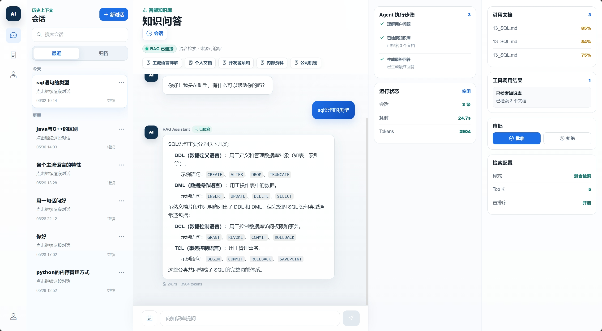
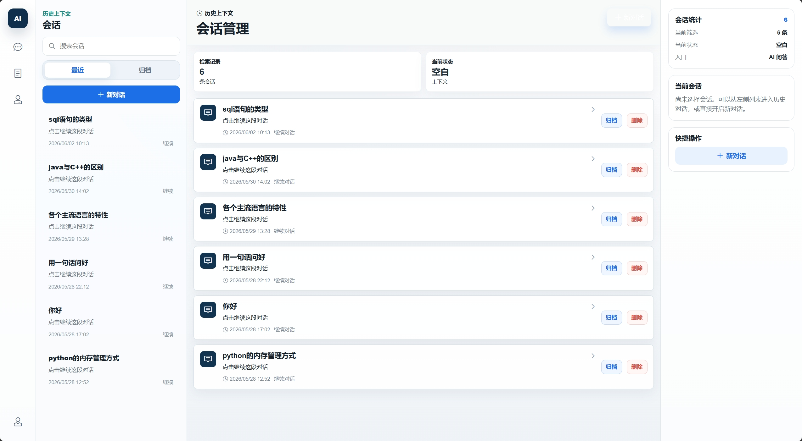
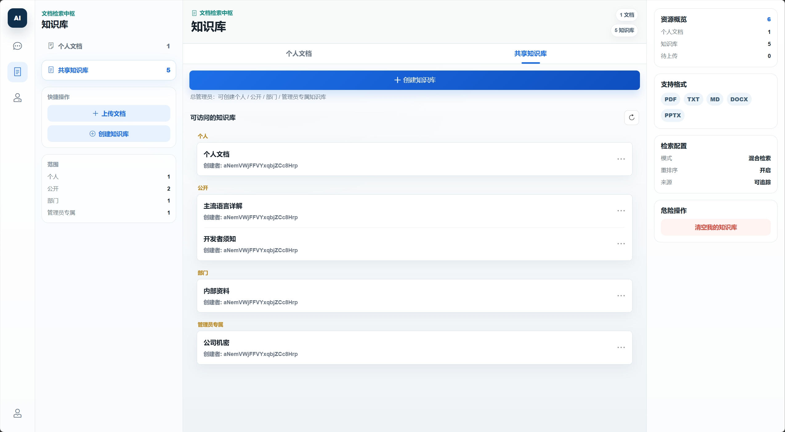
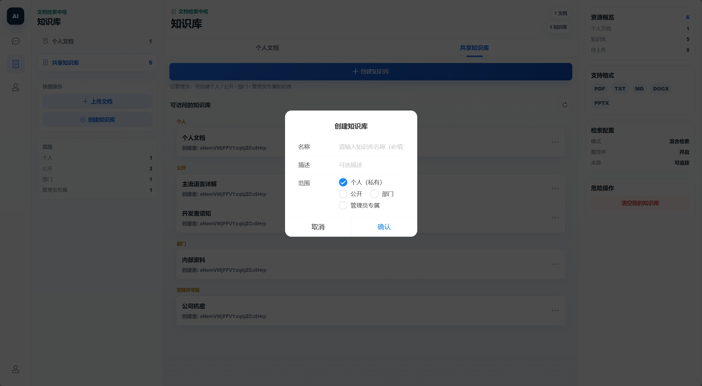
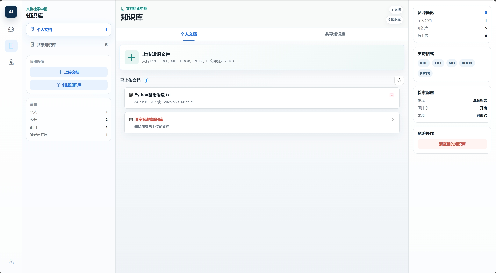
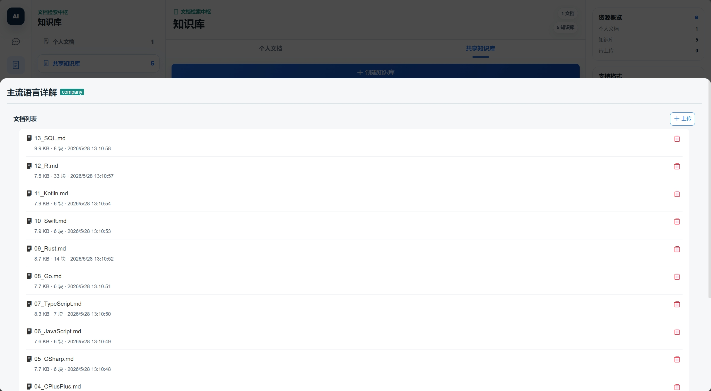
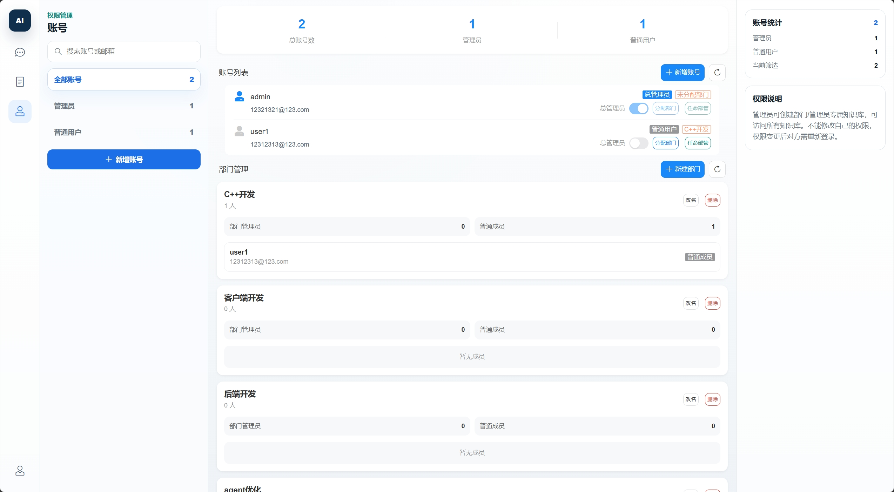
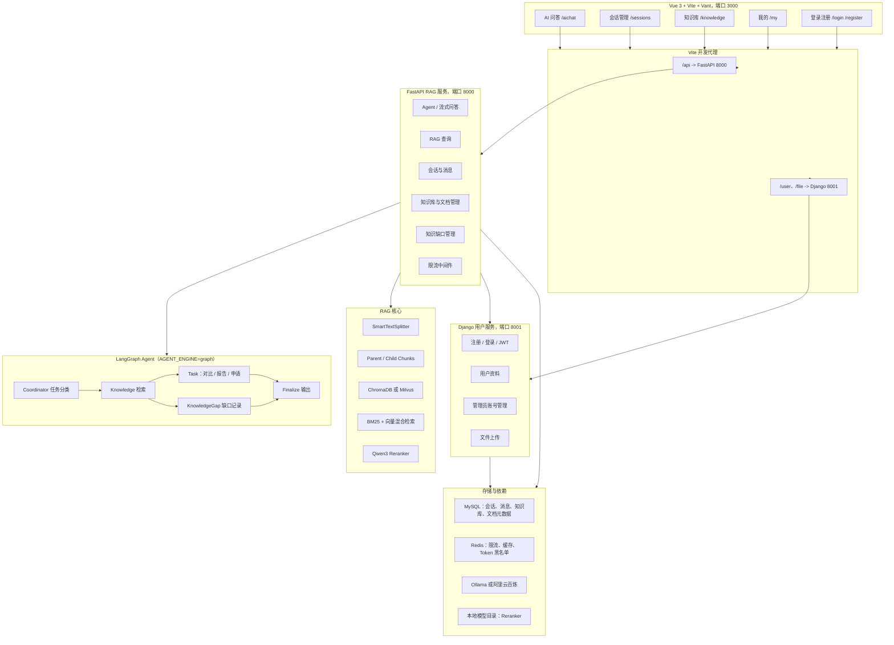

# LangChain RAG FastAPI Service

一个移动端优先的企业知识库问答系统，前端使用 Vue 3 + Vant，后端由 FastAPI RAG 服务和 Django 用户服务组成。项目支持用户登录、会话持久化、知识库管理、文档上传、向量检索、BM25 混合检索、重排序和流式 AI 问答。

当前项目更像一个完整的“知识库 + AI 问答”应用，而不是单纯的 LangChain demo：用户可以登录后创建或访问知识库，上传文档，在 AI 问答页基于个人或共享知识进行追问，并在会话页管理历史对话。

后端 Agent 默认走传统 loop 引擎；通过 `AGENT_ENGINE=graph` 可切换到 **LangGraph 多节点图引擎**：Coordinator 自动识别任务类型 → Knowledge 检索 → 在 Task（对比 / 报告 / 申请）和 KnowledgeGap（知识缺口记录）之间分流 → Finalize 输出，所有步骤都会以"识别任务类型 / 生成对比 / 记录知识缺口"等提示流式回传给前端。

## 目录

- [核心能力](#核心能力)
- [项目演示](#项目演示)
- [系统架构](#系统架构)
- [技术栈](#技术栈)
- [项目结构](#项目结构)
- [环境要求](#环境要求)
- [配置说明](#配置说明)
- [部署与启动](#部署与启动)
- [页面入口](#页面入口)
- [API 速览](#api-速览)
- [RAG 与知识库机制](#rag-与知识库机制)
- [LangGraph Agent 引擎](#langgraph-agent-引擎)
- [评估体系](#评估体系)
- [测试与构建](#测试与构建)
- [常见问题](#常见问题)
- [相关文档](#相关文档)

## 核心能力

- AI 问答：支持普通 RAG 查询和 Agent 流式问答，回答可携带来源引用。
- LangGraph Agent 引擎（可选）：Coordinator → Knowledge → Task / KnowledgeGap → Finalize 的多节点图，每个节点的执行步骤会作为 SSE 事件实时推送到前端。
- 任务执行：识别到「文档对比 / 报告生成 / 申请文本生成」时，调用对应 prompt 工具产出结构化结果，区别于纯问答。
- 知识缺口记录：检索 0 命中或置信极低时，LLM 抽取"未覆盖的知识点"自动落库，管理员可在「我的 → 知识缺口」页查看并改状态。
- 会话管理：FastAPI 侧将会话和消息持久化到 MySQL，前端提供会话列表、切换和删除。
- 知识库管理：支持个人、部门、公司范围的知识库，并提供成员权限模型。
- 文档管理：支持 `txt`、`pdf`、`md`、`docx`、`pptx` 文件上传、去重、记录、删除和检索。
- 混合检索：向量检索 + BM25 关键词检索，兼顾语义召回和精确词匹配。
- 父子分块：小块用于召回，大块用于给 LLM 提供完整上下文。
- 重排序：默认使用 Qwen3-Reranker-0.6B 对召回文档精排，也支持阿里云重排序配置。
- 多向量后端：默认 ChromaDB，本地需要独立向量服务时可切换 Milvus。
- 用户服务：Django 提供注册、登录、JWT、用户资料、管理员账号管理和文件上传接口。
- 移动端 UI：底部 Tab 覆盖 AI 问答、会话、知识库、我的四个主入口。

## 项目演示

以下截图来自项目实际界面，覆盖 AI 问答、会话管理、知识库管理、文档编译和账号权限等主要场景。

### AI 问答



基于个人或共享知识库进行流式问答，回答支持 Markdown 渲染、来源引用、Agent 执行步骤和审批操作。

### 会话管理



会话页支持搜索历史会话、继续对话、归档和删除，并在右侧展示会话统计与快捷操作。

### 知识库管理



支持个人文档和共享知识库两个视图，管理员可创建个人、公开、部门、管理员专属等不同范围的知识库。



创建知识库时可填写名称、描述并选择访问范围，便于按个人、部门或管理权限隔离知识。

### 文档上传与编译



个人知识库支持上传 `PDF`、`TXT`、`MD`、`DOCX`、`PPTX` 等文件，并展示资源概览、检索配置和危险操作。



知识库详情页可查看文档列表、分块数量、更新时间，并支持继续上传或删除指定文档。

### 账号管理



管理员可在账号管理页查看用户列表、创建账号、分配部门，并设置普通用户或管理员权限。

## 系统架构



## 技术栈

| 模块 | 技术 |
| --- | --- |
| 前端 | Vue 3、Vite 7、Vant 4、Vue Router、Pinia、vue-i18n、axios、marked、highlight.js、DOMPurify |
| RAG 后端 | FastAPI、LangChain、LangGraph、LangChain Community、LangChain Chroma、LangChain Milvus、SQLAlchemy、Pydantic、Redis |
| 用户服务 | Django 5.2、Django REST framework、Simple JWT、drf-yasg、Celery、django-redis |
| 向量与检索 | ChromaDB、Milvus、BM25、jieba、sentence-transformers、Qwen3-Reranker-0.6B |
| 模型服务 | 阿里云百炼 Qwen、Ollama、本地 reranker 模型 |
| 数据存储 | MySQL、Redis、本地 ChromaDB 文件、Milvus Docker Compose |

## 项目结构

```text
.
├── backend/                         # FastAPI RAG 服务
│   ├── app/
│   │   ├── agent/                   # LangChain Agent、工具和中间件
│   │   │   └── graph/               # LangGraph 图：coordinator/knowledge/task/knowledge_gap/finalize 节点
│   │   ├── tools/                   # 任务工具：compare/report/form 三类 prompt 构造器
│   │   ├── cache/                   # Redis 缓存装饰器
│   │   ├── config/                  # rag/chroma/milvus/agent/prompt 配置
│   │   ├── core/                    # 响应、限流、日志、异常处理
│   │   ├── db/                      # MySQL / Redis 初始化
│   │   ├── models/                  # 会话、消息、知识库、文档、分块、知识缺口表
│   │   ├── rag/                     # 检索、向量后端、重排序、切片
│   │   ├── router/                  # FastAPI 路由
│   │   ├── scheduler/               # 可选的目录监听导入任务
│   │   └── services/                # 会话、知识库、文档、父子块、知识缺口服务
│   ├── tests/                       # 后端测试
│   ├── main.py                      # FastAPI 入口
│   ├── pyproject.toml
│   └── .env.example
├── DjangoUserService/               # Django 用户服务
│   ├── apps/user/                   # 注册、登录、JWT、用户资料、管理员接口
│   ├── apps/file/                   # 文件上传接口
│   ├── DjangoUserService/           # Django settings / urls / celery
│   ├── manage.py
│   ├── pyproject.toml
│   └── .env.example
├── front/                           # Vue 3 移动端前端
│   ├── src/views/                   # AIChat、Sessions、KnowledgeBase、KnowledgeGaps、My 等页面
│   ├── src/components/              # TabBar 等公共组件
│   ├── src/config/api.js            # 前端 API 端点
│   ├── src/router/index.js          # 页面路由
│   ├── src/store/                   # Pinia store
│   └── vite.config.js               # Vite 代理配置（端口/代理目标支持环境变量覆盖）
├── docs/                            # 设计、计划、走查 runbook、测试语料、Milvus、模型、排障等文档
│   └── test-corpus/                 # 企业行政制度测试语料 + 批量上传脚本 + 测试问题清单
├── docker-compose.milvus.yml        # 可选 Milvus 单机栈
└── README.md
```

## 环境要求

| 依赖 | 建议版本 | 说明 |
| --- | --- | --- |
| Windows + PowerShell | 当前本地开发环境 | 项目已有大量 Windows 启动约定 |
| Python | backend >= 3.12；DjangoUserService >= 3.10 | 两个 Python 服务各自维护虚拟环境 |
| uv | 最新版 | Python 依赖管理 |
| Node.js | 20.19+ 或 22.12+ | Vite 7 的运行要求 |
| MySQL | 8.x 推荐 | Django 5.2 推荐 MySQL 8.0.11+；FastAPI 也使用 MySQL 兼容库 |
| Redis | 7.x 推荐 | 限流、缓存和 Token 黑名单 |
| Docker Desktop | 可选 | 用于 Redis、MySQL、Milvus 等容器化依赖 |
| Ollama | 可选但推荐 | 本地 embedding 或本地聊天模型 |
| 阿里云百炼 API Key | 可选 | 使用 Qwen 云端模型时需要 |

## 配置说明

### FastAPI 后端环境变量

在 `backend/.env` 中配置。下面是常用项，真实密钥不要提交到仓库：

```env
# LLM：ALIYUN 或 OLLAMA
LLM_TYPE=ALIYUN
OLLAMA_BASE_URL=http://localhost:11434
OLLAMA_MODEL_NAME=qwen3.5:0.8b
ALIYUN_ACCESS_KEY_SECRET=your_api_key
ALIYUN_BASE_URL=https://dashscope.aliyuncs.com/compatible-mode/v1
CHAT_MODEL_NAME=qwen3-max

# Embedding：OLLAMA 或 ALIYUN
EMBED_MODEL_TYPE=OLLAMA
TEXT_EMBEDDING_MODEL_NAME=qwen3-embedding:0.6b
ALIYUN_EMBED_MODEL_NAME=qwen3-embedding

# MySQL
MYSQL_USER=root
MYSQL_PASSWORD=your_password
MYSQL_HOST=127.0.0.1
MYSQL_PORT=3306
MYSQL_DATABASE=chat_history

# Redis
REDIS_HOST=127.0.0.1
REDIS_PORT=6379
REDIS_DB=0

# 向量后端：chroma 或 milvus
VECTOR_STORE_BACKEND=chroma
MILVUS_HOST=127.0.0.1
MILVUS_PORT=19530

# Django 用户服务
DJANGO_API_URL=http://127.0.0.1:8001

# Reranker
RERANKER_TYPE=LOCAL
RERANKER_MODEL_PATH=D:\Hugging_Face\models\Qwen3-Reranker-0.6B

# Agent 引擎：loop（默认，传统单轮）或 graph（LangGraph 多节点）
AGENT_ENGINE=loop

# JWT：必须和 DjangoUserService/.env 的 JWT_SECRET_KEY 一致
SECRET_KEY=change_me
ALGORITHM=HS256

# 可选：目录监听导入
SCHEDULER_ENABLED=false
SCHEDULER_WATCH_DIR=data/watch
SCHEDULER_INTERVAL_MINUTES=10
```

### Django 用户服务环境变量

在 `DjangoUserService/.env` 中配置：

```env
JWT_SECRET_KEY=change_me

DB_NAME=user_service
DB_USER=root
DB_PASSWORD=your_password
DB_HOST=127.0.0.1
DB_PORT=3306

CELERY_BROKER_URL=redis://127.0.0.1:6379/0
CELERY_RESULT_BACKEND=redis://127.0.0.1:6379/0
REDIS_CACHE_URL=redis://127.0.0.1:6379/1
```

注意：

- `SECRET_KEY` 和 `JWT_SECRET_KEY` 必须保持一致，否则 FastAPI 无法校验 Django 签发的 JWT。
- Windows 本地建议把 `localhost` 写成 `127.0.0.1`，避免 IPv6 回退导致接口或数据库请求变慢。
- 使用 Milvus 时先启动 `docker-compose.milvus.yml`，并把 `VECTOR_STORE_BACKEND=milvus`。
- `AGENT_ENGINE` 默认 `loop`（传统单轮 Agent）；切到 `graph` 启用 LangGraph 多节点引擎，会经过 Coordinator → Knowledge → Task / KnowledgeGap → Finalize 节点，前端会看到「识别任务类型 / 生成对比 / 记录知识缺口」等步骤提示。

### 前端环境变量

`front/vite.config.js` 支持以下进程级环境变量覆盖（多项目并存时避开端口冲突很有用）：

| 变量 | 默认值 | 说明 |
| --- | --- | --- |
| `FRONT_PORT` | `3000` | 前端本地开发端口 |
| `API_TARGET` | `http://127.0.0.1:8000` | `/api` 代理到的 FastAPI 地址 |
| `USER_TARGET` | `http://127.0.0.1:8001` | `/user`、`/file` 代理到的 Django 地址 |

PowerShell 启动示例（后端跑在 8010 时）：

```powershell
$env:API_TARGET = "http://127.0.0.1:8010"
npm run dev
```

## 部署与启动

以下步骤面向一台全新的部署机器，命令以 PowerShell 为例。部署时请把路径、数据库账号、模型和 API Key 替换为自己的环境，不要使用本机示例路径。

### 1. 获取代码

```powershell
git clone <your-repo-url> LangChain-RAG-FastAPI-Service
cd LangChain-RAG-FastAPI-Service
```

如果部署到 Linux 服务器，命令基本一致，只需要把虚拟环境路径和启动命令改成 Linux 写法，例如 `.venv/bin/python`、`.venv/bin/uvicorn`。

### 2. 准备基础环境

建议提前安装：

| 依赖 | 用途 |
| --- | --- |
| Python 3.12+ | FastAPI RAG 服务 |
| Python 3.10+ | Django 用户服务 |
| uv | Python 依赖安装与虚拟环境管理 |
| Node.js 20.19+ 或 22.12+ | Vue 3 / Vite 前端 |
| MySQL 8.x | 用户、会话、知识库和文档元数据 |
| Redis 7.x | 限流、缓存、Token 黑名单 |
| Ollama 或阿里云百炼 API Key | Embedding 与聊天模型 |
| Docker / Docker Compose | 可选，用于 Redis、MySQL、Milvus |

Redis 可以直接用 Docker 启动：

```powershell
docker run -d --name redis-rag -p 6379:6379 redis:alpine
```

如果使用 Milvus 作为向量库：

```powershell
docker compose -f docker-compose.milvus.yml up -d
```

如果使用 Ollama embedding：

```powershell
ollama serve
ollama pull qwen3-embedding:0.6b
```

### 3. 安装项目依赖

```powershell
cd backend
uv sync

cd ..\DjangoUserService
uv sync

cd ..\front
npm install
```

### 4. 创建数据库

MySQL 中需要创建两个数据库，名称可以按 `.env` 调整：

```sql
CREATE DATABASE chat_history CHARACTER SET utf8mb4 COLLATE utf8mb4_unicode_ci;
CREATE DATABASE user_service CHARACTER SET utf8mb4 COLLATE utf8mb4_unicode_ci;
```

### 5. 配置环境变量

复制示例配置，并按部署机器实际信息修改：

```powershell
Copy-Item backend\.env.example backend\.env
Copy-Item DjangoUserService\.env.example DjangoUserService\.env
```

重点检查以下配置：

| 文件 | 配置项 | 说明 |
| --- | --- | --- |
| `backend/.env` | `MYSQL_*` | FastAPI 使用的 MySQL 连接 |
| `backend/.env` | `REDIS_*` | Redis 地址和 DB |
| `backend/.env` | `LLM_TYPE`、`EMBED_MODEL_TYPE` | 选择阿里云百炼或 Ollama |
| `backend/.env` | `ALIYUN_ACCESS_KEY_SECRET` | 使用百炼时填写自己的 API Key |
| `backend/.env` | `DJANGO_API_URL` | Django 用户服务地址，默认 `http://127.0.0.1:8001` |
| `backend/.env` | `VECTOR_STORE_BACKEND` | `chroma` 或 `milvus` |
| `backend/.env` | `RERANKER_MODEL_PATH` | 本机 reranker 模型目录，按自己的机器修改 |
| `backend/.env` | `SECRET_KEY` | 必须与 Django 的 `JWT_SECRET_KEY` 一致 |
| `DjangoUserService/.env` | `DB_*` | Django 用户库连接 |
| `DjangoUserService/.env` | `JWT_SECRET_KEY` | 必须与 FastAPI 的 `SECRET_KEY` 一致 |

Windows 部署建议把数据库和服务地址写成 `127.0.0.1`，不要写 `localhost`，可避免 IPv6 回退导致请求变慢。

### 6. 初始化数据库

```powershell
cd DjangoUserService
.\.venv\Scripts\python.exe manage.py migrate
```

FastAPI 会在启动时自动执行 SQLAlchemy `create_all`，用于创建会话、消息、知识库、文档等表。Django 的用户表需要先执行 `migrate`。

### 7. 启动服务

需要启动三个应用服务：Django 用户服务、FastAPI RAG 服务、Vue 前端。

Django 用户服务：

```powershell
cd DjangoUserService
cmd /c "set HTTP_PROXY=& set HTTPS_PROXY=& set http_proxy=& set https_proxy=& .\.venv\Scripts\python.exe manage.py runserver 127.0.0.1:8001"
```

FastAPI RAG 服务：

```powershell
cd backend
cmd /c "set HTTP_PROXY=& set HTTPS_PROXY=& set http_proxy=& set https_proxy=& .\.venv\Scripts\uvicorn.exe main:app --host 127.0.0.1 --port 8000 --reload"
```

Vue 前端：

```powershell
cd front
npm run dev -- --host 127.0.0.1
```

如果部署到局域网或服务器，请把前端 host 改成 `0.0.0.0`，并开放 `3000`、`8000`、`8001` 对应端口。生产环境建议只暴露前端和网关端口，由 Nginx 反向代理到后端服务。

### 8. 生产部署建议

开发启动可以直接使用 `npm run dev` 和 `--reload`。生产环境建议：

1. 前端执行构建并把 `front/dist` 交给 Nginx 托管：

```powershell
cd front
npm run build
```

2. Nginx 将 `/api` 代理到 FastAPI，将 `/user` 和 `/file` 代理到 Django。
3. FastAPI 使用 `uvicorn` 或进程管理器常驻运行，Django 使用 `gunicorn`、`uvicorn` 或平台服务管理器常驻运行。
4. 所有密钥、数据库密码、API Key 通过服务器环境变量或 `.env` 管理，不要提交到仓库。
5. MySQL、Redis、Milvus 和模型目录应使用持久化磁盘，避免容器重建后数据丢失。

Nginx 反向代理示例：

```nginx
server {
    listen 80;
    server_name your-domain.com;

    root /path/to/LangChain-RAG-FastAPI-Service/front/dist;
    index index.html;

    location / {
        try_files $uri $uri/ /index.html;
    }

    location /api/ {
        proxy_pass http://127.0.0.1:8000/api/;
        proxy_set_header Host $host;
        proxy_set_header X-Real-IP $remote_addr;
    }

    location /user/ {
        proxy_pass http://127.0.0.1:8001/user/;
        proxy_set_header Host $host;
        proxy_set_header X-Real-IP $remote_addr;
    }

    location /file/ {
        proxy_pass http://127.0.0.1:8001/file/;
        proxy_set_header Host $host;
        proxy_set_header X-Real-IP $remote_addr;
    }
}
```

### 9. 验证部署

```powershell
Invoke-WebRequest -Uri "http://127.0.0.1:8000/" -UseBasicParsing
Invoke-WebRequest -Uri "http://127.0.0.1:8001/docs/" -UseBasicParsing
Invoke-WebRequest -Uri "http://127.0.0.1:3000/" -UseBasicParsing
```

期望结果：

- FastAPI 根路由返回 `{"message":"Hello World"}`。
- Django 文档页可访问。
- 前端页面可打开，并能完成注册、登录、上传文档和知识库问答。

### 10. 访问地址

| 服务 | 地址 |
| --- | --- |
| 前端应用 | `http://127.0.0.1:3000` |
| FastAPI 文档 | `http://127.0.0.1:8000/docs` |
| Django Swagger | `http://127.0.0.1:8001/docs/` |
| Django ReDoc | `http://127.0.0.1:8001/redoc/` |

## 页面入口

| 页面 | 路由 | 说明 |
| --- | --- | --- |
| AI 问答 | `/aichat`、`/aichat/:sessionId` | 新对话、历史会话追问、流式回答、Markdown 渲染 |
| 会话管理 | `/sessions` | 查看、进入和删除历史会话 |
| 知识库 | `/knowledge` | 创建知识库、查看文档、上传文档、触发知识库问答 |
| 知识缺口 | `/knowledge-gaps` | 查看 LangGraph KnowledgeGap 节点产生的待补充条目（普通用户看自己的，管理员看全部，可改状态） |
| 我的 | `/my` | 用户信息、设置、账号管理入口、知识缺口入口 |
| 登录 / 注册 | `/login`、`/register` | 用户认证 |
| 个人资料 | `/profile` | 用户资料维护 |
| 设置 | `/settings` | 偏好设置 |
| 账号管理 | `/admin/accounts` | 管理员用户管理 |

## API 速览

### FastAPI RAG 服务

| 方法 | 路径 | 说明 |
| --- | --- | --- |
| `POST` | `/api/agent/query/stream` | Agent 流式问答 |
| `POST` | `/api/rag/query` | 普通 RAG 查询 |
| `GET` | `/api/session/{session_id}` | 获取单个会话历史 |
| `DELETE` | `/api/session/{session_id}` | 删除会话 |
| `GET` | `/api/sessions` | 获取当前用户会话 |
| `POST` | `/api/vector/add/single` | 上传单个文档到个人知识 |
| `POST` | `/api/vector/add/multiple` | 批量上传文档 |
| `GET` | `/api/vector/list` | 查看个人文档 |
| `DELETE` | `/api/vector/document/{doc_id}` | 删除文档 |
| `DELETE` | `/api/vector/clean` | 清空个人文档 |
| `POST` | `/api/kb` | 创建知识库 |
| `GET` | `/api/kb/list` | 查看可访问知识库 |
| `PATCH` | `/api/kb/{kb_id}` | 更新知识库 |
| `DELETE` | `/api/kb/{kb_id}` | 删除知识库 |
| `POST` | `/api/kb/{kb_id}/documents` | 上传文档到知识库 |
| `GET` | `/api/kb/{kb_id}/documents` | 查看知识库文档 |
| `POST` | `/api/kb/{kb_id}/query` | 在指定知识库内问答 |
| `GET` | `/api/knowledge-gaps` | 列出知识缺口（管理员看全部，普通用户看自己的，可按 `status` 筛选） |
| `PATCH` | `/api/knowledge-gaps/{gap_id}` | 修改知识缺口状态：`pending` / `reviewed` / `resolved` / `ignored` |

### Django 用户服务

| 方法 | 路径 | 说明 |
| --- | --- | --- |
| `POST` | `/user/register/` | 注册 |
| `POST` | `/user/login/` | 登录并签发 JWT |
| `POST` | `/user/logout/` | 登出并加入 Token 黑名单 |
| `POST` | `/user/refresh-token/` | 刷新 Token |
| `GET` | `/user/detail/` | 获取当前用户信息 |
| `PUT/PATCH` | `/user/update/` | 更新用户资料 |
| `GET` | `/user/list/` | 管理员获取用户列表 |
| `PATCH` | `/user/{uuid}/set-admin/` | 设置管理员权限 |
| `POST` | `/file/upload/` | 文件上传 |

## RAG 与知识库机制

### 向量后端

通过 `VECTOR_STORE_BACKEND` 选择后端：

- `chroma`：默认嵌入式模式，数据保存在 `backend/data/chromadb`。
- `milvus`：独立向量服务，依赖 `docker-compose.milvus.yml` 中的 etcd、MinIO、Milvus。

### 文档处理

1. 上传文件后写入文档记录表，记录 `doc_id`、`user_id`、`kb_id`、文件名、MD5、大小和分块数。
2. 文本按语言智能分块，生成父块和子块。
3. 子块写入向量库，同时保存到 MySQL，供 BM25 构建索引。
4. 同名或相同 MD5 的文档按用户和知识库范围隔离，避免跨用户误判。

### 检索流程

1. 根据用户和知识库权限过滤可访问内容。
2. 向量检索召回语义相似子块。
3. BM25 召回关键词相关子块。
4. 合并召回结果并映射到父块上下文。
5. 使用 reranker 精排。
6. 将上下文交给 LLM 生成回答，并返回引用来源。

### 知识库权限

知识库支持 `personal`、`dept`、`company` 范围。成员权限分为：

- `viewer`：可检索。
- `editor`：可上传和删除文档。
- `admin`：可管理成员和删除知识库。

## LangGraph Agent 引擎

将后端环境变量切到 `AGENT_ENGINE=graph` 后，`/api/agent/query/stream` 不再走传统 loop，而是走 `backend/app/agent/graph/` 下的多节点图：

```text
START → coordinator → (knowledge | finalize)
        knowledge → (knowledge_gap | task | finalize)
        knowledge_gap → finalize
        task → finalize → END
```

各节点职责：

| 节点 | 作用 |
| --- | --- |
| `coordinator` | LLM 把用户问题归类到 `knowledge_qa` / `document_compare` / `report_generation` / `document_generation` / `knowledge_gap` 之一，并初始化执行计划 |
| `knowledge` | 命中知识库的混合检索 + reranker，把候选文档塞进 state |
| `task` | 当任务类型属于「对比 / 报告 / 申请」时，调用 `app/tools/` 下对应的 prompt 构造器（`compare_tool` / `report_tool` / `form_tool`）让 LLM 产出结构化结果 |
| `knowledge_gap` | 检索结果空或最高 `relevance_score` 低于阈值时，LLM 抽出未覆盖的知识点，去重过滤后写入 `knowledge_gaps` 表，并把"已记录待补充条目"写回 task_messages |
| `finalize` | 汇总 task_messages / knowledge 上下文 / 引用，生成最终回答；同时发送 token 用量事件 |

每个节点执行时都会通过 GraphRunner 把"识别任务类型 / 检索知识 / 生成对比 / 记录知识缺口 / 生成回答"这类步骤事件 push 到前端，前端聊天页的「步骤」区会逐条显示。

知识缺口落库后会出现在 `/knowledge-gaps` 页：管理员看全部、普通用户只看自己产生的，状态可改 `pending` → `reviewed` / `resolved` / `ignored`。

> 实测语料、走查命令和典型问题清单见 [docs/test-corpus/README.md](./docs/test-corpus/README.md) 与 [docs/walkthroughs/p5b-knowledge-gap-walkthrough.md](./docs/walkthroughs/p5b-knowledge-gap-walkthrough.md)。

## 评估体系

项目不止于把功能搭起来，还配了一套**配置驱动、可重复、支持消融对比**的评估管线（代码在 [`backend/eval/`](./backend/eval/)），用数据量化每个机制的真实收益——也就是「评估驱动迭代」而不是「凭感觉调参」。

**三层指标**，每层有独立的 ground truth：

| 层 | 指标 | 标尺 |
| --- | --- | --- |
| 检索 | recall@1 / recall@3 / MRR | 标注的 `expected_doc` |
| 回答 | 事实断言通过率 / grounding 忠实度 / rubric 覆盖率 | `answer_assertions`、引用文档 |
| 编排 | 路由准确率 / 缺口精确率·召回率 | `expected_route`、`expect_gap_triggered` |

**消融对比**（约 100 题人工标注集，子进程隔离注入开关，样本偏小、定位为指示性）：

| 配置 | 缺口精确率 | rubric 覆盖率 | 忠实度 | 平均延迟 |
| --- | --- | --- | --- | --- |
| baseline | 0.50 | 0.55 | 0.52 | 6.6s |
| **+critic** | **0.87** | **0.69** | **0.65** | 7.5s |
| +hyde | 0.52 | 0.59 | 0.51 | 18.9s |

> 检索层 recall@1=0.881、MRR=0.933、事实断言通过率 0.99。

**几个用数据做的工程决策**：

- **critic 自我修正闭环有效**：把知识缺口判定精确率从 0.50 提到 0.87、rubric 覆盖率 0.55→0.69、忠实度 0.52→0.65；
- **HyDE 默认关，是算出来的**：开启后平均延迟从 6.6s 涨到 18.9s（约 3 倍），但检索和回答指标反而没涨，故默认关、保留为可配开关；
- **LLM-judge 可信度**：judge 用千问（与被测的 DeepSeek 跨家族）规避自评偏袒，配合 temperature=0、逐点 rubric 核对、人工校准一致性。

一条命令（`python -m eval.runner`）跑完整个配置矩阵，产出三层指标对比表 + 成本表。

## 测试与构建

前端生产构建：

```powershell
cd front
npm run build
```

后端测试：

```powershell
cd backend
.\.venv\Scripts\python.exe -m pytest
```

Django 基础检查：

```powershell
cd DjangoUserService
.\.venv\Scripts\python.exe manage.py check
```

常用烟测：

```powershell
Invoke-WebRequest -Uri "http://127.0.0.1:3000/" -UseBasicParsing
Invoke-WebRequest -Uri "http://127.0.0.1:8000/" -UseBasicParsing
Invoke-WebRequest -Uri "http://127.0.0.1:8001/docs/" -UseBasicParsing
```

## 常见问题

### 前端改了但浏览器没变化

优先检查 3000 端口的 Vite 进程路径。它必须指向当前要调试的项目 `front` 目录。路径错了就停掉旧进程，从正确目录重新启动。

### FastAPI 调 Django 超时

本机代理可能拦截了 `127.0.0.1` 请求。启动 Django 和 FastAPI 时清空代理变量：

```powershell
cmd /c "set HTTP_PROXY=& set HTTPS_PROXY=& set http_proxy=& set https_proxy=& <启动命令>"
```

### Django 或数据库操作很慢

Windows 下 `localhost` 可能先走 IPv6 再回退，建议 `.env` 中统一使用 `127.0.0.1`。

### 知识库接口返回 401

需要先登录并让前端携带 `Authorization: Bearer <token>`。FastAPI 会调用 Django `/user/detail/` 校验用户身份。

### Redis 连接失败

确认 6379 端口已启动：

```powershell
docker start redis-rag
```

### Reranker 首次启动慢

首次启动会检查或下载 Qwen3-Reranker-0.6B。确认 `RERANKER_MODEL_PATH` 指向可写且空间充足的目录。

### Vite build 提示 chunk 超过 500 kB

当前 AI 问答页依赖 Markdown、高亮、净化和聊天渲染逻辑，生产构建可能出现 chunk size warning。这是性能优化提示，不代表构建失败。

## 相关文档

- [FastAPI API 文档](./backend/api.md)
- [Django 用户服务 API](./DjangoUserService/api.md)
- [前端 API 说明](./front/api.md)
- [测试语料与一键灌库脚本](./docs/test-corpus/README.md)
- [知识缺口走查 runbook](./docs/walkthroughs/p5b-knowledge-gap-walkthrough.md)
- [设计文档](./docs/design/)
- [实现计划](./docs/plans/)
- [ModelScope 模型说明](./docs/modelscope_model.md)
- [Milvus 迁移说明](./docs/migrate-to-milvus.md)
- [故障排除](./docs/troubleshooting.md)
