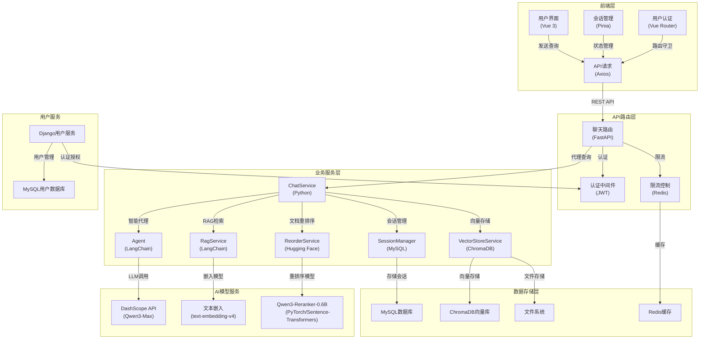

# 🚀 智能对话服务 (v1.1.0)

## 📋 目录

- [项目简介](#项目简介)
- [核心特性](#核心特性)
- [项目演示](#项目演示)
- [快速开始](#快速开始)
- [技术栈](#技术栈)
- [项目结构](#项目结构)
- [API 文档](#api-文档)
- [配置说明](#配置说明)
- [部署指南](#部署指南)
- [开发指南](#开发指南)
- [故障排除](#故障排除)
- [文档](#文档)
- [联系方式](#联系方式)

## 项目简介

这是一个基于 FastAPI + LangChain 构建的企业级智能对话系统，集成了先进的 RAG（检索增强生成）技术，能够基于文档内容提供高精度的智能问答服务。系统采用微服务架构，具备会话持久化、多语言支持和模块化设计等特性。

## 核心特性

- **智能问答** 💬：基于 RAG 技术，结合文档检索和大语言模型，提供精准的问答体验
- **会话持久化** 💾：使用 MySQL 存储会话历史，支持长期保存和回溯
- **多语言支持** 🌐：前端集成 i18n，支持中英文界面切换
- **文档管理** 📄：支持文档上传、处理和智能检索
- **微服务架构** 🏗️：分离的用户服务和对话服务，易于扩展和维护
- **高性能** ⚡：基于 FastAPI 和 ChromaDB，提供卓越的性能表现

## 项目流程图




## 项目演示

### AI 聊天界面


### 聊天管理界面


### 用户服务界面


## 快速开始

### 环境要求

#### 后端环境
- Python 3.12+
- uv

#### 前端环境
- Node.js 16+
- npm 或 pnpm

### 克隆项目

```bash
git clone https://github.com/RMA-MUN/LangChain-RAG-FastAPI-Service.git
cd LangChain-RAG-FastAPI-Service
```

### 安装依赖

#### 后端依赖
```bash
# 进入后端目录
cd backend

# 使用 uv 安装依赖
uv sync
```

#### 前端依赖
```bash
# 进入前端目录
cd front

# 安装依赖
npm install
# 或使用 pnpm
pnpm install
```

### 环境配置

#### 创建环境变量文件
在 `backend` 目录下创建 `.env` 文件，参考.env.example文件填写个人配置：

```env
# DashScope API Key (必填)
DASHSCOPE_API_KEY=your_dashscope_api_key

# 数据库配置
DB_HOST=localhost
DB_PORT=3306
DB_USER=root
DB_PASSWORD=your_password
DB_NAME=chatbot

# 安全配置
SECRET_KEY=your_secret_key

# 重排序模型配置（可选）
RERANKER_MODEL_PATH=D:\Hugging_Face\models\Qwen3-Reranker-0.6B

# LangSmith_API_KEY，自行前往 https://smith.langchain.com/ 官网注册获取api key
LANGCHAIN_TRACING_V2=true
LANGCHAIN_API_KEY=your_langsmith_api_key
LANGCHAIN_PROJECT=my-fastapi-langchain-project
```

在DjangoUserService目录下，手动创建.env文件，内部配置参考.env.example，填入自己实际的值

```env
# 环境配置

# JWT 配置
JWT_SECRET_KEY=YOUR_JWT_SECRET_KEY

# 数据库配置
DB_PORT=YOUR_DB_PORT
DB_NAME=YOUR_DB_NAME
DB_USER=YOUR_DB_USER
DB_PASSWORD=YOUR_DB_PASSWORD
DB_HOST=YOUR_DB_HOST

# Celery 配置
CELERY_BROKER_URL=YOUR_CELERY_BROKER_URL
CELERY_RESULT_BACKEND=YOUR_CELERY_RESULT_BACKEND
CELERY_TASK_TIME_LIMIT=YOUR_CELERY_TASK_TIME_LIMIT
CELERY_TASK_SOFT_TIME_LIMIT=YOUR_CELERY_TASK_SOFT_TIME_LIMIT
CELERY_RESULT_EXPIRES=YOUR_CELERY_RESULT_EXPIRES

# redis 配置
REDIS_CACHE_URL=YOUR_REDIS_CACHE_URL
```

### Hugging Face 模型配置

详细的模型下载和配置说明请参考：[Hugging Face 模型配置](./docs/huggingface_model.md)

#### 模型配置
修改 `backend/app/config/rag.yaml` 文件：

```yaml
# 聊天模型配置
chat_model_name: qwen3-max

# 文本嵌入模型配置
text_embedding_model_name: text-embedding-v4
```

#### 向量数据库配置
修改 `backend/app/config/chroma.yaml` 文件：

```yaml
# 向量数据库配置
collection_name: rag_collection
persist_directory: data/chromadb
k: 3

# 文件处理配置
data_path: data
md5_hex_store: data/md5_hex_store/md5_hex_store.txt
allow_knowledge_file_types: ["txt", "pdf"]

# 文档切分配置
chunk_size: 200
chunk_overlap: 20
separators: ["\n\n", "\n", "。", "！", "？", "!", "?", " ", ""]
```

### 启动服务

#### 启动后端服务
```bash
cd backend
uvicorn main:app --reload
```
服务将在 `http://localhost:8000` 运行。

#### 启动前端服务
```bash
cd front
npm run dev
# 或使用 pnpm
pnpm run dev
```
前端将在 `http://localhost:3000` 运行。

#### 启动用户服务
```bash
# 进入 Django 用户服务目录
cd DjangoUserService

# 使用 uv 安装依赖
uv sync

# 启动 Django 服务
uv run python manage.py runserver 8001
```
用户服务将在 `http://localhost:8001` 运行。

#### 启动mysql服务

```bash
# 管理员运行cmd或powershell
net start mysql
```

#### 启动redis服务

```bash
# 如果你是直接解压安装的redis
redis-server

# 如果是服务版的redis，管理员打开终端
net start redis
```

#### 其他服务

```bash
# 如果使用ollama本地的模型，需要启动ollama服务
ollama serve
```


## 技术栈

### 后端技术
- **FastAPI** ⚡：高性能异步 Web 框架
- **LangChain** 🦜：大语言模型应用开发框架
- **ChromaDB** 📚：轻量级向量数据库，用于高效文档检索
- **Django** 🎯：用户认证和管理系统
- **MySQL** 🗄️：关系型数据库，用于存储用户数据和会话历史
- **Redis** ⚡：缓存数据库，用于提高系统性能
- **DashScope API** 🔑：提供大语言模型和嵌入模型服务
- **Hugging Face** 🤗：提供预训练模型和模型下载服务
- **PyTorch** 🧠：深度学习框架，用于模型推理
- **Sentence-Transformers** 📝：句子嵌入和语义匹配库

### 前端技术
- **Vue 3** 🖼️：现代化前端框架
- **Vite** ⚡：极速构建工具
- **Vue Router** 🛣️：路由管理
- **Pinia** 📦：状态管理
- **i18n** 🌍：国际化支持

## 项目结构

```
├── backend/                  # FastAPI 后端服务
│   ├── app/                  # 应用代码
│   │   ├── agent/            # 智能代理模块
│   │   ├── config/           # 配置文件目录
│   │   ├── model/            # 数据模型定义
│   │   ├── prompt/           # 提示词模板
│   │   ├── rag/              # RAG 核心功能
│   │   ├── router/           # API 路由定义
│   │   ├── services/         # 业务服务层
│   │   └── utils/            # 工具函数
│   ├── data/                 # 数据存储目录
│   ├── main.py               # 应用入口文件
│   └── requirements.txt      # 后端依赖列表
├── front/                    # Vue 前端项目
│   ├── src/                  # 源代码
│   ├── public/               # 静态资源
│   └── package.json          # 前端依赖配置
├── DjangoUserService/        # Django 用户服务
└── README.md                 # 项目说明文档
```

## API 文档

### FastAPI 后端 API
- **[API 文档](./backend/api.md)**：查看详细的 API 接口文档
- **[交互式文档](http://localhost:8000/docs)**：启动服务后访问自动生成的交互式 API 文档

### Django 用户服务 API
- **[API 文档](./DjangoUserService/api.md)**：查看详细的用户服务 API 文档
- **[交互式文档](http://localhost:8000/api/)**：启动服务后访问用户服务 API 文档

## 配置说明

### 数据库配置
在 `backend/app/config/db_config.py` 中配置 MySQL 连接：

```python
# MySQL 配置
DB_CONFIG = {
    "host": os.getenv("DB_HOST", "localhost"),
    "port": int(os.getenv("DB_PORT", "3306")),
    "user": os.getenv("DB_USER", "root"),
    "password": os.getenv("DB_PASSWORD", ""),
    "database": os.getenv("DB_NAME", "chatbot"),
}
```

### API Key 配置
在 `.env` 文件中设置 DashScope API Key：

```env
DASHSCOPE_API_KEY=your_dashscope_api_key
```

### 模型配置
在 `backend/app/config/rag.yaml` 中配置模型参数：

```yaml
# 聊天模型名称
chat_model_name: qwen3-max

# 文本嵌入模型名称
text_embedding_model_name: text-embedding-v4
```

### 向量数据库配置
在 `backend/app/config/chroma.yaml` 中配置向量数据库参数：

```yaml
# 向量数据库配置
collection_name: rag_collection
persist_directory: data/chromadb
k: 3

# 文件处理配置
data_path: data
md5_hex_store: data/md5_hex_store/md5_hex_store.txt
allow_knowledge_file_types: ["txt", "pdf"]

# 文档切分配置
chunk_size: 200
chunk_overlap: 20
separators: ["\n\n", "\n", "。", "！", "？", "!", "?", " ", ""]
```

## 部署指南

详细的部署说明请参考：[部署指南](./docs/deployment.md)

## 开发指南

### 代码结构说明
- **backend/app/rag/**：RAG 核心功能，包括向量存储和检索
- **backend/app/agent/**：智能代理，处理用户请求和对话逻辑
- **backend/app/services/**：业务服务层，提供会话管理等功能
- **backend/app/utils/**：工具函数，包括配置加载、文件处理等
- **front/src/views/**：前端页面组件
- **front/src/components/**：可复用的前端组件

### 开发流程
1. **添加新功能**
   - 在对应的模块中添加代码
   - 运行测试确保功能正常
   - 更新相关文档
2. **调试技巧**
   - 使用 FastAPI 的自动重载功能：`uvicorn main:app --reload`
   - 使用 Vue 的热更新功能：`npm run dev`

## 故障排除

详细的故障排除指南请参考：[故障排除](./docs/troubleshooting.md)

## 文档

项目文档位于 `docs/` 目录：

- **[Hugging Face 模型配置](./docs/huggingface_model.md)**：详细的模型下载和配置说明
- **[部署指南](./docs/deployment.md)**：生产环境部署详细步骤
- **[故障排除](./docs/troubleshooting.md)**：常见问题和解决方案
- **[API 文档](./backend/api.md)**：后端 API 接口文档
- **[用户服务 API](./DjangoUserService/api.md)**：用户服务 API 文档

## 联系方式

如有任何问题或建议，请随时联系我们。😊
